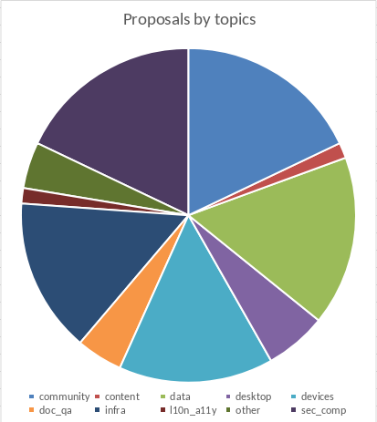
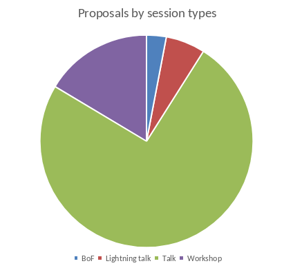
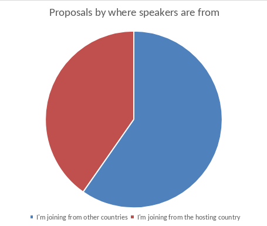

We have just closed our call for proposals yesterday! Thank you everyone who submitted session proposal this year.

# Some numbers

How many proposals we received this year? We received total 67 proposals. Let's try to group by with several criterias.

## By topics

This year, most of proposals were submitted under "Community", "Security and Compliance" topics followed by "Data, AI and ML" and "Devices and IoT".

| Topics (Tracks) | Proposals received |
| --- | --- |
| Community |	12 |
| Security and Compliance |	12 |
| Data, AI and ML |	11 |
| Devices and IoT |	10 |
| Cloud and Infrastructure |	10 |
| Desktop and WSL |	4 |
| Documentations and QA |	3 |
| Other |	3 |
| Content and Design |	1 |
| Localizations and Accessibility |	1 |

## By session types

More then half of proposals we received were submitted under "Talk". We also received many Workshops this year!

| Session types | Proposals received |
| --- | --- |
| Talk |	50 |
| Workshop |	11 |
| Lightning talk | 4 |
| BoF |	2 |

## By where speakers are from

Interesting number this year would be that more then half of proposals were submitted by people coming from across the world. Note that we have many people submitted multiple proposals this year.

| Where are you coming from? | Proposals received |
| --- | --- |
I'm joining from other countries |	40 |
I'm joining from the hosting country |	27 |

# So, What to do now?

If you have submitted session proposal(s), Content team folks are now busy reviewing them. While reviewing your proposal, Our content reviews might have some questions or feedbacks. In that case, they will leave some comments on your proposal and that would send you some email notifications. So, please make sure to check your inbox and don't miss email notifications from Indico! You might also want to check "My abstracts" section of [this page on Indico](https://events.canonical.com/event/127/abstracts/). Clicking your submission item would send you to your proposal detail page which would also show you comments sections on buttom. You'll be able to find comments from our content team folks in case they left some comments.

When you will be receiving acceptance notifications? Our goal this year is to review all proposals by end of this month, then send out acceptance notifications by mid of May. But since we are all doing this on spare time, please understnad that there could be some possible delays.

# See you all in Kathmandu!

Again, thank you all for submitting session proposals this year! And hopefully we can meet you all in Kathmandu!

If you have any questions regarding contents, feel free to reach out us with chat or email!
- Telegram: [https://t.me/UbuConAsia](https://t.me/UbuConAsia)
- Matrix: [https://matrix.to/#/#ubucon-asia:ubuntu.com](https://matrix.to/#/#ubucon-asia:ubuntu.com)
- Email: Content team - content@ubucon.asia
