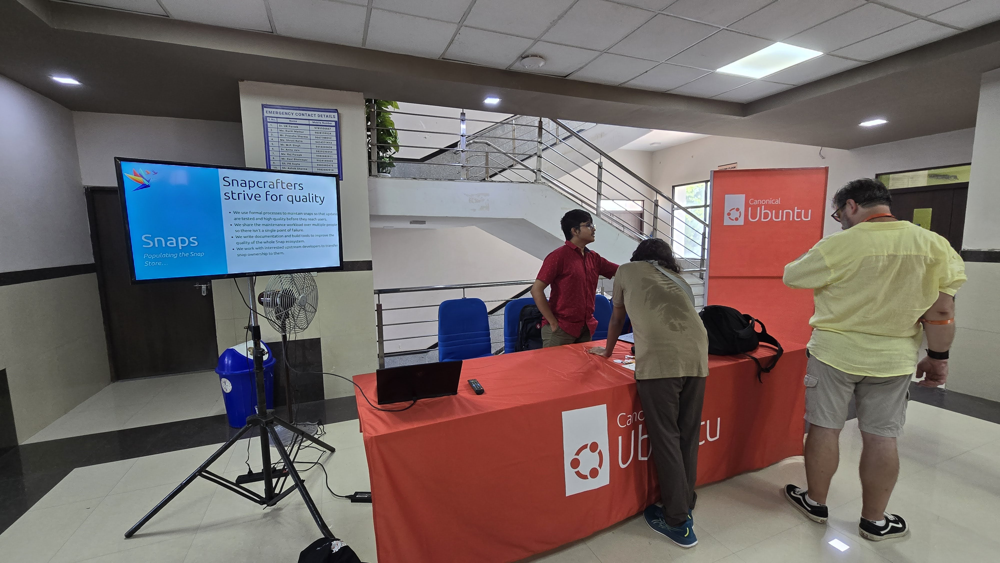

UbuCon Asia this year in Kathmandu, Nepal will be running exhibition area just like last year. This time, We will be also providing booth not only for business who bought sponsorship package that includes booth benefit or booth only package, but also for FOSS community and projects as complimentary.

By running a booth for your FOSS community or projects, You will be able to intereact with conference participants closely to exhibit and promote your work.

Interested to get a booth? Head over to the link below then apply for community booth today!

[Exhibitions page on Website](https://2025.ubucon.asia/programs/exhibitions/)

