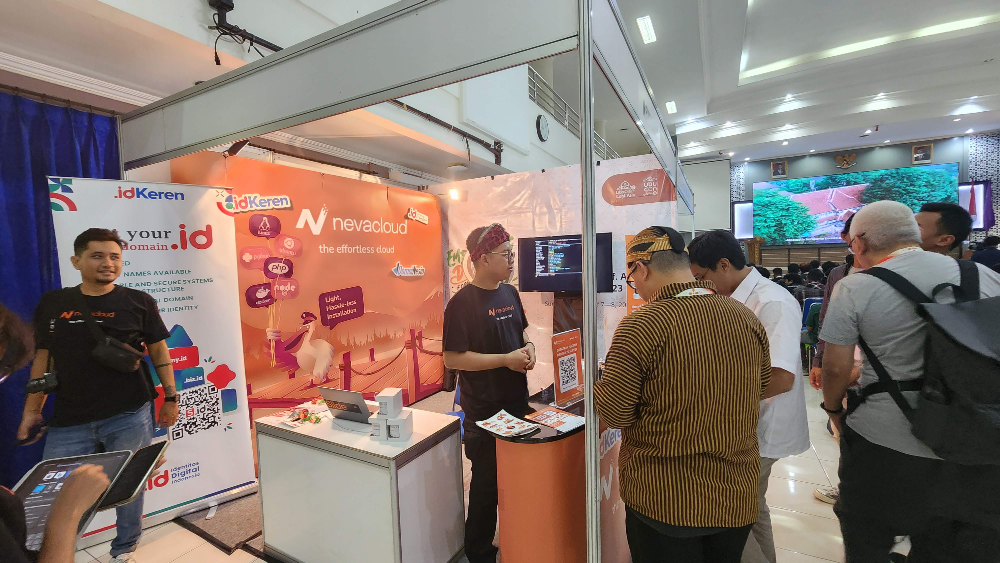

UbuCon Asia 2025 now offers 3 new things in our sponsorship program! If you couldn't find packages that fits your budget and needs, We hope these new packages would be helpful for your business and organizations!

## Supporter package - Startup pricing
We heard many businesses (especially local businesses in Nepal considering to sponsor us) hesitate to sponsor us due to their budget constraints, The new startup pricing for Supporter package is now available allowing startups to join us as a sponsor easier.

- Pricing for startups: 200 - 800 USD (or 30,000 - 1,00,000 NPR)
- Only available for companies that use Ubuntu internally, have been established for ve years or less, and have 30 or fewer employees.

## Exhibitor package
If your business just want to get a booth at UbuCon Asia 2025, We now also offer "Exhibitor package". Just like the name suggests, It includes benefits that allow your business to exhibit to our audiences but with more affortable pricing. If you don't want other benefits, But just want to exhibit, this would be a good option for you!

- Pricing: 600 USD (or 50,000 NPR for Local sponsors)
- Benets
    - S size booth & Logistics support
    - 3 Tickets with exhibition area access only
    - Logo exposure on exhibitors information page on our website

## Diversity funds package
Do you want to see and meet more diverse audiences across the world who might be your future global talents? Contributing to our event by purchasing "Diversity funds package" help us to bring more diverse people across the world (especially underrated people or group in the community) to the event in-person by providing them travel grants.

- Pricing: 200 - 700 USD (or 20,000 - 70,000 NPR for Local sponsors)
- Benets: Logo exposure on travel grant page on our website and beneciaries' event report

Interested in securing new sponsorship packages above? [You may find more details on the website,](https://2025.ubucon.asia/sponsors/become-a-sponsor/) [then contact our sponsorship team today!](mailto:sponsorship@ubucon.asia)